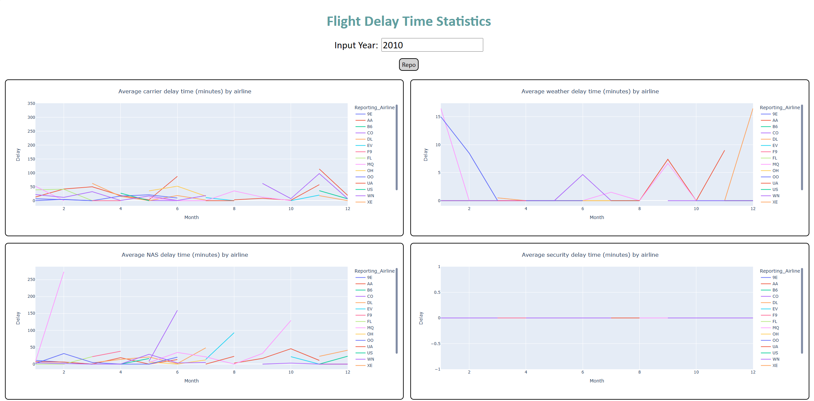

# Flight-Delay-Statistics

## Description

Flight-Delay-Statistics is a project aimed at visualizing and analyzing flight delay data using Python and various data visualization libraries. This project provides insights into different types of flight delays and their impacts over time organized by reporting airline.

## Table of Contents 
	
- [Installation](#installation)
- [Usage](#usage)
- [Methodology](#methodology)
- [Results](#results)
- [Conclusion](#conclusion)
- [License](#license)

## Installation

To run this project locally, follow these steps:

1. Clone the repository:
    ```bash
    git clone https://github.com/CxLos/Flight_Delay_Statistics
    ```
2. Navigate to the project directory:
    ```bash
    cd Flight_Delay_Statistics
    ```
3. Install the required dependencies:
    ```bash
    pip install -r requirements.txt
    ```

## Usage

To launch the dashboard, execute the following command in your terminal or click the following link:

[Flight Delay Statistics Dashboard](https://flight-delay-statistics-b070eee730f6.herokuapp.com/)

```bash
python app.py
```



## Methodology

The data for this project can be downloaded here: 

[Flight Delay Statistics](https://cf-courses-data.s3.us.cloud-object-storage.appdomain.cloud/IBMDeveloperSkillsNetwork-DV0101EN-SkillsNetwork/Data%20Files/airline_data.csv)

### Plans for collected Data

- Implement real-time data streaming to continuously update flight delay statistics and improve the accuracy of the dashboard.
- Enhance data visualization techniques to include interactive maps showcasing regional variations in flight delays.
- Incorporate machine learning models to predict potential flight delays based on historical data and external factors like weather forecasts.
- Collaborate with aviation industry partners to gather additional data sources and expand the scope of analysis to include factors such as airport operations and air traffic management.
- Conduct periodic data analyses and publish insights or reports highlighting trends, patterns, and actionable recommendations for stakeholders in the aviation sector.

## Results

### Average Carrier Delay Time

* This line chart displays the average carrier delay times for different reporting airlines. Carrier delays are delays that occur due to circumstances within the airline's control, such as maintenance or crew issues. Understanding the average carrier delay times for each airline can help identify operational efficiency and customer service improvements.

### Average Weather Delay Time

* This line chart showcases the average weather delay times for different reporting airlines. Weather delays are caused by inclement weather conditions that affect flight operations. Analyzing the average weather delay times can aid in contingency planning and route optimization for airlines.

### Average NAS Delay Time

* This line chart illustrates the average National Airspace System (NAS) delay times for different reporting airlines. NAS delays occur due to factors such as air traffic control, airport congestion, or airspace restrictions. Identifying trends in NAS delay times can assist in airspace management and infrastructure enhancements.

### Average Security Delay Time

* This line chart presents the average security delay times for different reporting airlines. Security delays are delays caused by security-related issues, such as screening procedures or security incidents. Analyzing security delay times can contribute to enhancing airport security protocols and passenger experiences.

### Average Late Aircraft Delay Time

* This line chart depicts the average late aircraft delay times for different reporting airlines. Late aircraft delays occur when the incoming aircraft for a flight is delayed, affecting subsequent departures. Understanding late aircraft delay times can aid in scheduling optimizations and fleet management.

## Conclusion

The Flight-Delay-Statistics project offers valuable insights into the average delay times across different categories, including carrier delays, weather delays, NAS delays, security delays, and late aircraft delays, organized by reporting airlines. By visualizing and analyzing this data, stakeholders in the aviation industry can make data-driven decisions to improve operational efficiency, customer satisfaction, and overall flight performance.

As I continue to enhance this project and incorporate additional data sources, I hope to provide even deeper insights into flight delay patterns and their impacts.

Thank you for exploring the Flight Delay Statistics Dashboard!

## License

MIT License

Copyright (c) 2022 CxLos

Permission is hereby granted, free of charge, to any person obtaining a copy
of this software and associated documentation files (the "Software"), to deal
in the Software without restriction, including without limitation the rights
to use, copy, modify, merge, publish, distribute, sublicense, and/or sell
copies of the Software, and to permit persons to whom the Software is
furnished to do so, subject to the following conditions:

The above copyright notice and this permission notice shall be included in all
copies or substantial portions of the Software.

THE SOFTWARE IS PROVIDED "AS IS", WITHOUT WARRANTY OF ANY KIND, EXPRESS OR
IMPLIED, INCLUDING BUT NOT LIMITED TO THE WARRANTIES OF MERCHANTABILITY,
FITNESS FOR A PARTICULAR PURPOSE AND NONINFRINGEMENT. IN NO EVENT SHALL THE
AUTHORS OR COPYRIGHT HOLDERS BE LIABLE FOR ANY CLAIM, DAMAGES OR OTHER
LIABILITY, WHETHER IN AN ACTION OF CONTRACT, TORT OR OTHERWISE, ARISING FROM,
OUT OF OR IN CONNECTION WITH THE SOFTWARE OR THE USE OR OTHER DEALINGS IN THE
SOFTWARE.